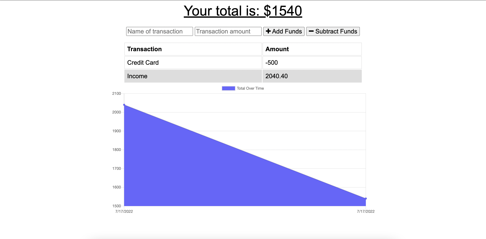
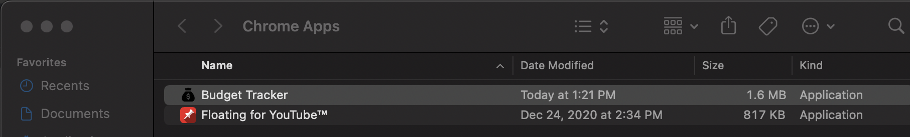
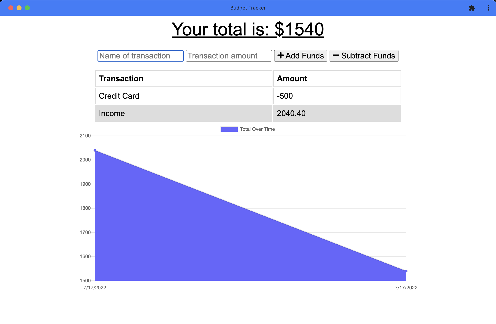

# Budget Tracker

## Description
Budget Tracker is a Progressive Web Application that allows a user to manage their transactions with ease. It allows for offline functionality as well as offline access. When a user does not have access to a stable internet connection, they will still be able to record their transactions and can rest assured that their data will be stored and uploaded the moment an internet connection is reestablished.

## Table of Contents
* [Installation](#Installation)
* [Usage](#Usage)
* [License](#License)
* [Contributing](#Contributing)
* [Tests](#Tests)
* [Questions](#Questions)

## Installation
To install the necessary dependencies please run the following command:

`npm i`

## Usage
This project can be used at ones own leisure

## License
        
This project is licensed under the MIT license

## Contributing
To contribute to this project, please fork and push to a new brancg and contact me to review for a potential merge.

## Tests
To run tests, run the following command:

There are curently no tests to run on this application

## Questions
If there are any questions concerning this project, please open an issue or contact me directly at just.julio95@gmail.com.

If you would like to see more of my work, please visit my [Github](https://github.com/justjulio95).

## Preview

